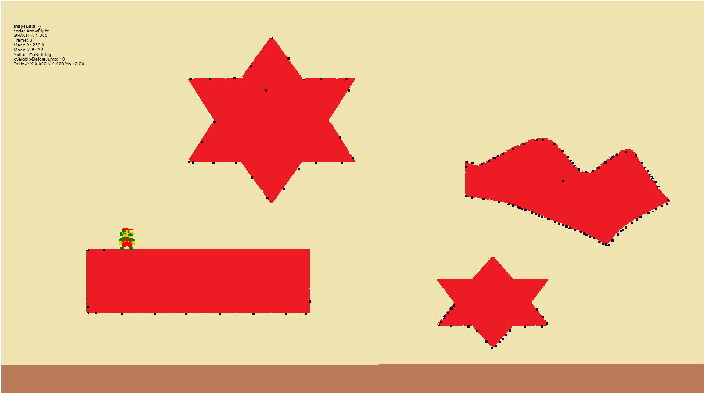

### Mario game based on javascript

Features:
* gravity
* keyboard handling ( ARROWS + SPACE)
* mario sprite sheets
* shape recognitions (not perfect)

Shape recognitions:
Background fully loaded, shape recognition algorithm will identify the shapes and their edges.
After that Mario can jump/run on it.
Shapes (platforms) has to be drawn by red color :D ....

